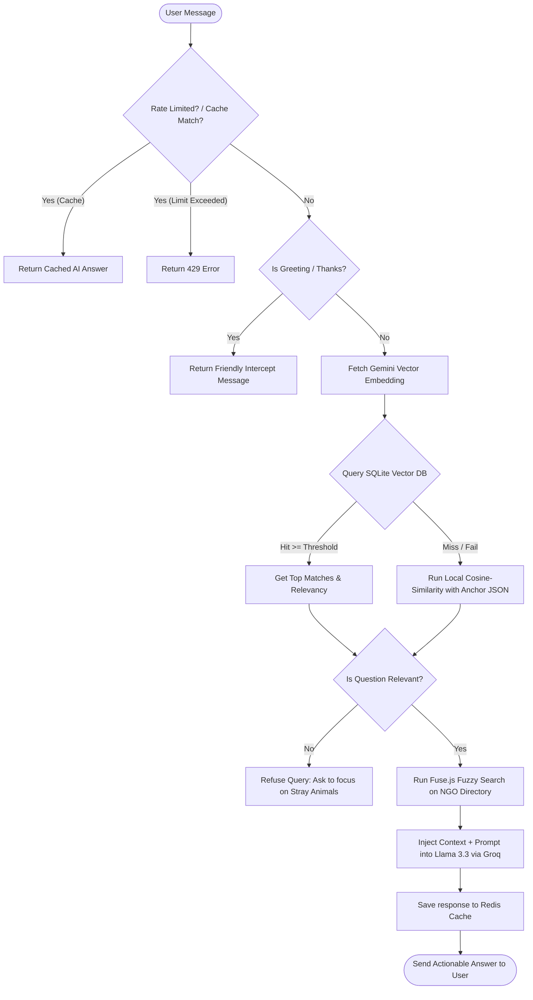

# 🐾 Hope - Stray Animal Care & Rescue Assistant (Kolkata)

<div align="center">

[](https://nextjs.org/)
[](https://react.dev/)
[](https://www.typescriptlang.org/)
[](https://tailwindcss.com/)
[](https://www.framer.com/motion/)

[](https://groq.com/)
[](https://ai.google.dev/)
[](https://upstash.com/)
[](https://www.sqlite.org/)
[](https://vercel.com/)

<p align="center">
  <strong>Hope</strong> is a premium, AI-powered web portal and rescue assistant dedicated to stray animal care, first aid, and welfare coordination in Kolkata, India.
</p>

<h4>
  🌐 <a href="https://hope-81g3.vercel.app">Live Demo Link</a>
</h4>

---

</div>

## 📖 Overview

In street-level animal care emergencies, every second counts. Citizens often find themselves in situations where they lack basic first-aid knowledge or don't know who to call for immediate rescue. 

**Hope** solves this by bridging the gap between caretakers and rescue teams. It combines an **AI stray animal care chatbot** (named Hope) with a **verified Kolkata NGO Directory**, **emergency resource guides**, and an **organization enlistment portal** to streamline strays' rescue and welfare in Kolkata.

---

## ✨ Features

- 💬 **Smart Stray Care Assistant ("Hope")**:
  - Provides instant, context-aware instructions for stray first-aid (wounds, fractures, heat stress), feeding guidelines, vaccination advice, and emergency safety.
  - Custom **Retrieval-Augmented Generation (RAG)** engine injects relevant Kolkata NGO details into responses based on query geography and nature.
- 🔍 **Multi-Tier Semantic Relevancy Engine**:
  - Filters out irrelevant off-topic prompts using **Gemini Embeddings** mapped against a vector space database.
  - Queries local **SQLite vector tables (`better-sqlite3`)** for similar contexts, falling back to a lightweight in-memory cosine-similarity check if the database is unpopulated.
- ⚡ **Production-Grade Performance & Security**:
  - Integrated with **Upstash Redis** for fast query response caching and token-saving.
  - Employs client IP-based sliding-window **Rate Limiting** to secure backend endpoints against spam.
- 📞 **Verified Kolkata NGO Contacts Directory**:
  - A clean, filterable portal linking caretakers directly to verified phone numbers, email addresses, websites, and service scopes for active Kolkata NGOs.
- 🐾 **Resource Guides**:
  - **India Canine Vaccination Schedule**: Timeline mapping for DHPPi, Anti-Rabies, and Leptospirosis.
  - **Summer Care Guide**: Actionable tips for feeding, watering, and cooling stray dogs and cats during extreme heat.
- 📥 **NGO Enlistment Request Form**:
  - Dynamic registration portal for new local organizations. Submissions trigger automated email notifications to administrators via the **Resend API**.

---

## 🏗️ How the AI Chatbot Works (Workflow)



---

## 🛠️ Technology Stack

- **Frontend & Routing**: [Next.js 15+ (App Router)](https://nextjs.org/), [React 19](https://react.dev/), [TypeScript](https://www.typescriptlang.org/)
- **Styling**: [Tailwind CSS 4.0](https://tailwindcss.com/), [shadcn/ui](https://ui.shadcn.com/)
- **Animations**: [Framer Motion](https://www.framer.com/motion/)
- **Orchestration**: [LangChain Core](https://js.langchain.com/) & [AI SDK](https://sdk.vercel.ai/)
- **LLM Provider**: [ChatGroq](https://console.groq.com/) (Llama-3.3-70b-versatile)
- **Embeddings Provider**: [Google Generative AI](https://ai.google.dev/) (`gemini-embedding-2`)
- **Fuzzy Search Directory**: [Fuse.js](https://www.fusejs.io/)
- **Local Database**: [SQLite (`better-sqlite3`)](https://github.com/WiseLibs/better-sqlite3)
- **Caching & Rate Limiting**: [Upstash Redis](https://upstash.com/)
- **Mail Carrier Service**: [Resend](https://resend.com/)


---

## 🚀 Local Development Setup

To run the application locally, follow these steps:

### 1. Clone & Install Dependencies
```bash
git clone https://github.com/your-username/hope.git
cd hope
npm install
```

### 2. Seed the Local Vector Database
The application relies on cached text embeddings for vector retrieval. Seed the local SQLite database (`hope.db`):
```bash
npm run db:seed
```

### 3. Start the Development Server
```bash
npm run dev
```
Open [http://localhost:3000](http://localhost:3000) in your browser to view the application.

---

## 🌍 Deployment on Vercel

### SQLite Database Note on Serverless
This application contains a SQLite database file `hope.db` committed directly to Git, which will be built and bundled with Vercel. 
* **Read-only vector search** will work successfully in production.
* **Dynamic runtime updates** (via the admin indexing API) will **not persist** permanently because Vercel Serverless Functions have an ephemeral filesystem. If you require runtime updates to vector indices in production, consider migrating the logic to a hosted service like **Upstash Vector** or **Pinecone**.

### Deploy Steps
1. Push your latest code changes to your GitHub repository.
2. Sign in to your dashboard on [Vercel](https://vercel.com).
3. Click **Add New...** -> **Project** and import your repository.
4. Expand **Environment Variables** and enter the credentials listed in the [Environment Configuration](#%EF%B8%8F-environment-configuration) section.
5. Click **Deploy**. Vercel will build, optimize, and launch your application!

---

## 📜 Disclaimer

*The AI assistant "Hope" provides first-aid guidance and resource information retrieved from general guidelines and local NGOs. It does not replace professional veterinary diagnostics or medical care. In high-risk, life-threatening scenarios, always contact a verified veterinarian or local emergency rescue immediately.*

---

<div align="center">
  Made with 🐾 for the strays of Kolkata.
</div>
